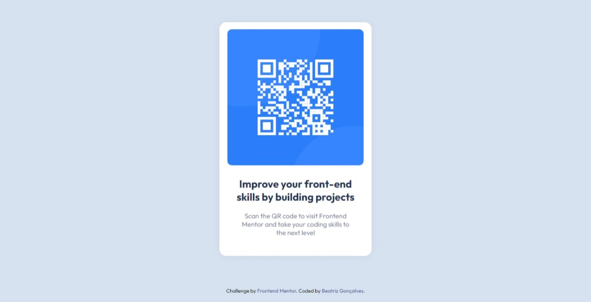

# Frontend Mentor - QR code component solution

Essa é a solução para o [desafio do Frontend Mentor - QR code component](https://www.frontendmentor.io/challenges/qr-code-component-iux_sIO_H). Os desafios do Frontend Mentor ajudam você a melhorar suas habilidades de codificação através da construção de projetos realistas.

## Tabela de conteúdos

- [Visão Geral](#visao-geral)
  - [Screenshot](#screenshot)
  - [Links](#links)
- [Meu processo](#meu-processo)
  - [Construído com](#construido-com)
  - [O que eu aprendi](#o-que-eu-aprendi)
  - [Desenvolvimento contínuo](#desenvolvimento-continuo)
- [Autora](#autora)


## Visão Geral


### Screenshot




### Links

- URL da solução: [https://github.com/beatrizvsgoncalves/qr-code-component-main](https://github.com/beatrizvsgoncalves/qr-code-component-main)
- URL do site: [https://beatrizvsgoncalves.github.io/qr-code-component-main/](https://beatrizvsgoncalves.github.io/qr-code-component-main/)


## Meu processo


### Construído com

- HTML5 semântica
- Flexbox


### O que eu aprendi

No desenvolvimento deste projeto eu aprendi a fazer com que o footer fique sempre no final da página. 
Usando **display: flex**, **flex-direction: column** e **min-height: 100vh** no conteiner, **flex: 1** no conteúdo principal e **flex-shrink: 0** no footer. 

```css
body {
  display: flex;
  flex-direction: column;
  min-height: 100vh;
}

main {
  flex: 1;
}

footer.attribution { 
  flex-shrink: 0;
}
```


### Desenvolvimento contínuo

Foi um projeto bem simples então não tive muitas dificuldades para realizá-lo. Mas foi bem empolgante por ser o meu primeiro desafio no Frontend Mentor. Estou ansiosa para fazer mais!

E algo que eu quero aprender mais e continuar me refinando é no posicionamento dos elementos. É algo que eu sinto que me falta muito conhecimento ainda e que eu poderia fazer melhor.


## Autora

- Github - [beatrizvsgoncalves](https://github.com/beatrizvsgoncalves)
- LinkedIn - [beatriz-vs-goncalves](https://www.linkedin.com/in/beatriz-vs-goncalves/)
- Frontend Mentor - [@beatrizvsgoncalves](https://www.frontendmentor.io/profile/beatrizvsgoncalves)


